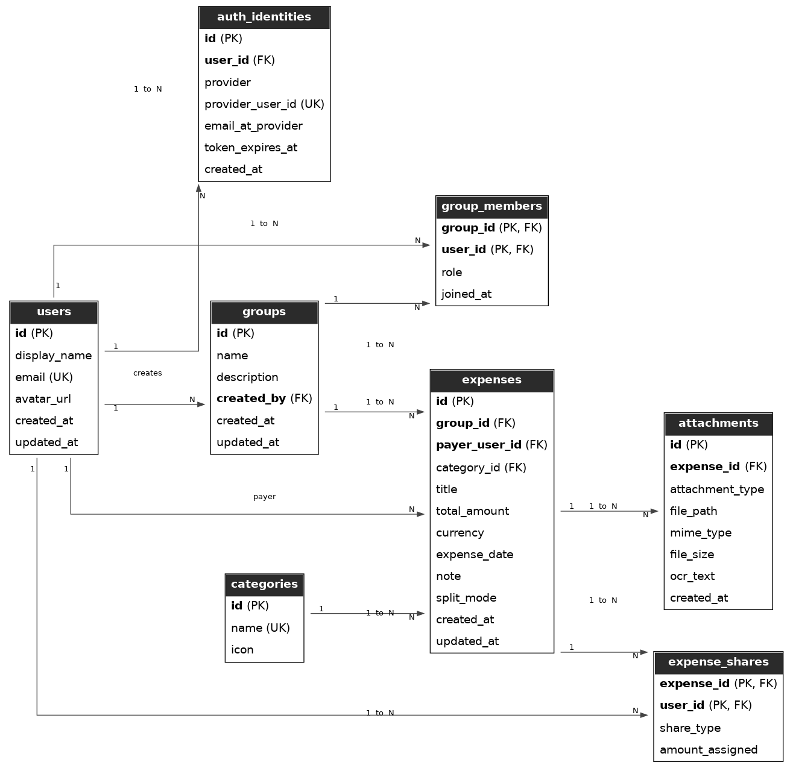
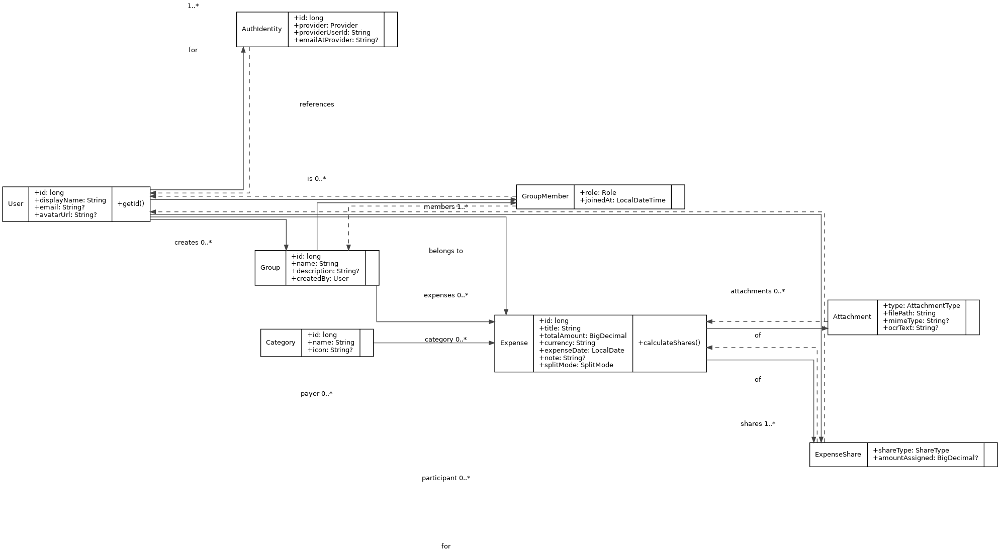
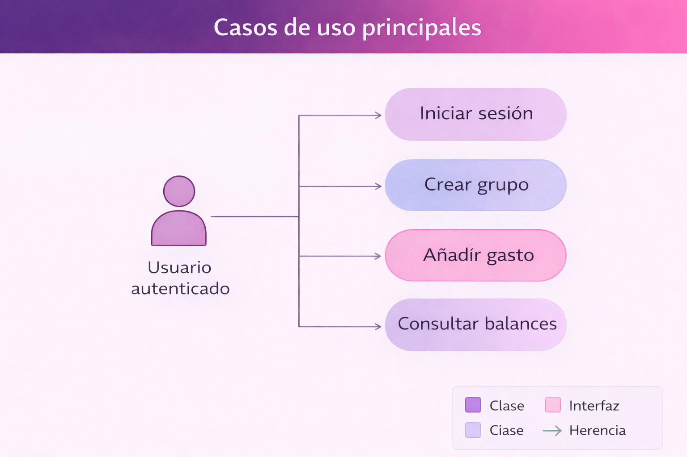
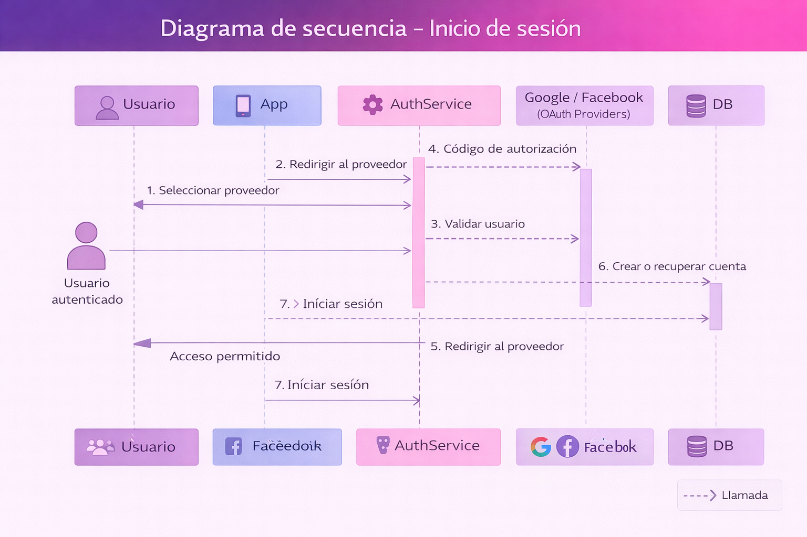

# SplitUp

> Autor: Alejandro Córdoba Pérez  
> Proyecto: SplitUp  
> Última actualización: 2026-02-03

<div align="center">
  

  <br>

**Aplicación de reparto de gastos en grupo**  
Inspirada en Tricount · Desarrollada en Java

</div>

---

## Descripción general del proyecto

**SplitUp** es una aplicación diseñada para facilitar la gestión y el reparto de gastos compartidos entre grupos de personas.

El proyecto se desarrolla como **Trabajo de Fin de Grado (TFG)** del ciclo de  
**Desarrollo de Aplicaciones Multiplataforma (DAM)** en el **IES Lope de Vega**.

La aplicación permite crear grupos, registrar gastos, asignar participantes y calcular automáticamente los balances finales, indicando de forma clara quién debe dinero y a quién.

---

## Objetivos del proyecto

- Aplicar **Programación Orientada a Objetos** de forma coherente.
- Diseñar una **arquitectura reutilizable en Java**.
- Separar correctamente la **lógica de negocio** de las interfaces.
- Desarrollar una aplicación **multiplataforma**:
  - Aplicación Desktop en Java (planificada)
  - Aplicación móvil Android (planificada)
- Gestionar datos mediante **MySQL**.
- Documentar todo el proceso técnico y las decisiones de diseño.

---

## Arquitectura general

El proyecto se divide en tres bloques principales:

- **Core (Java)**  
  Núcleo de la aplicación con la lógica de negocio y persistencia.  
  Implementado actualmente: usuarios, grupos y membresías; gastos y balances en progreso.

- **Aplicación Desktop (Java)**  
  Interfaz de usuario de escritorio (planificada).

- **Aplicación Android (Java)**  
  Aplicación móvil desarrollada en Android Studio reutilizando el core (planificada).

---

## Diagramas del proyecto

<div align="center">

<a href="docs/diagramas/ERD.png">
  
</a>

**ERD – Modelo Entidad / Relación**

<br><br>

<a href="docs/diagramas/UML_clases.png">
  
</a>

**UML – Diagrama de clases (Core)**

<br><br>

<a href="docs/diagramas/casos_uso.png">
  
</a>

**Diagrama de casos de uso**

<br><br>

<a href="docs/diagramas/secuencia_login.png">
  
</a>

**Diagrama de secuencia – Inicio de sesión**

</div>

---

## Base de datos

- Sistema gestor: **MySQL**
- Gestión: **MySQL Workbench**
- Scripts:
  - `db/schema.sql`
  - `db/seeds.sql`
  - `db/pruebasDb.sql`

📌 Incidencia real documentada:

- Uso de palabra reservada `groups` en MySQL
- Corrección aplicada: `expense_groups`  
  (Ejemplo real para la defensa del TFG)

---

## Estado del proyecto

🟢 **Fase 0 – Identidad:** Completada  
🟢 **Fase 1 – Análisis y diseño:** Completada  
🟢 **Fase 2 – Base de datos (MySQL):** Completada  
🟡 **Fase 3 – Core en Java:** En progreso (modelo base y Hibernate operativos)

📌 Hoja de ruta y seguimiento:  
[`ROADMAP_SplitUp.md`](ROADMAP_SplitUp.md)

📌 Resumen técnico del progreso:  
[`docs/06-recap-tecnico.md`](docs/06-recap-tecnico.md)

---

## Estructura del repositorio

```txt
SplitUp/
├── .gitattributes
├── README.md
├── ROADMAP_SplitUp.md
├── .github/
├── .vscode/
├── app-android/
│   └── SplitUpApp/
├── app-desktop/
│   └── src/
├── assets/
│   └── logo/
│       └── splitup-logo-gradient.png
├── core/
│   ├── pom.xml
│   └── src/
│       ├── main/
│       │   ├── java/com/splitup/
│       │   │   ├── app/TestHibernate.java
│       │   │   ├── model/
│       │   │   │   ├── ExpenseGroup.java
│       │   │   │   ├── GroupMember.java
│       │   │   │   ├── User.java
│       │   │   │   ├── enums/
│       │   │   │   │   ├── AttachmentType.java
│       │   │   │   │   ├── AuthProvider.java
│       │   │   │   │   ├── GroupRole.java
│       │   │   │   │   ├── ShareType.java
│       │   │   │   │   └── SplitMode.java
│       │   │   │   └── ids/
│       │   │   │       └── GroupMemberId.java
│       │   │   ├── service/
│       │   │   └── utils/
│       │   │       └── HibernateUtil.java
│       │   └── resources/
│       │       ├── hibernate.properties
│       │       └── logback.xml
│       └── test/
│           └── java/com/splitup/
│               └── AppTest.java
│   └── target/
├── db/
│   ├── pruebasDb.sql
│   ├── schema.sql
│   └── seeds.sql
└── docs/
    ├── 00-vision.md
    ├── 01-requisitos.md
    ├── 02-casos-de-uso.md
    ├── 03-modelo-datos-er.md
    ├── 04-diagrama-clases.md
    ├── 05-decisiones-tecnicas.md
    ├── 06-recap-tecnico.md
    └── diagramas/
        ├── casos_uso.png
        ├── ERD.png
        ├── secuencia_login.png
        └── UML_clases.png
```
