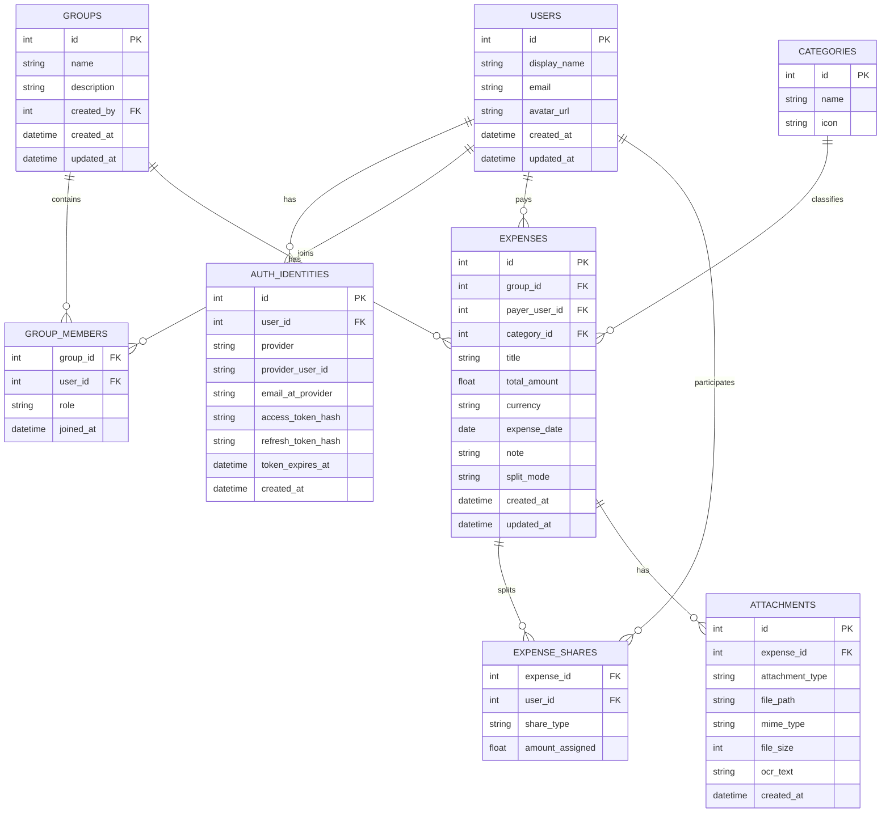

# Modelo ER (Mermaid)

> Nota: En el README se muestra la imagen exportada (PNG).  
> Aquí se mantiene el diagrama en Mermaid como fuente editable.

```mermaid
erDiagram
  USERS ||--o{ AUTH_IDENTITIES : has
  USERS ||--o{ GROUP_MEMBERS : joins
  GROUPS ||--o{ GROUP_MEMBERS : contains
  GROUPS ||--o{ EXPENSES : has
  USERS ||--o{ EXPENSES : pays
  EXPENSES ||--o{ EXPENSE_SHARES : splits
  USERS ||--o{ EXPENSE_SHARES : participates
  EXPENSES ||--o{ ATTACHMENTS : has
  CATEGORIES ||--o{ EXPENSES : classifies

  USERS {
    int id PK
    string display_name
    string email
    string avatar_url
    datetime created_at
    datetime updated_at
  }

  AUTH_IDENTITIES {
    int id PK
    int user_id FK
    string provider
    string provider_user_id
    string email_at_provider
    string access_token_hash
    string refresh_token_hash
    datetime token_expires_at
    datetime created_at
  }

  GROUPS {
    int id PK
    string name
    string description
    int created_by FK
    datetime created_at
    datetime updated_at
  }

  GROUP_MEMBERS {
    int group_id FK
    int user_id FK
    string role
    datetime joined_at
  }

  CATEGORIES {
    int id PK
    string name
    string icon
  }

  EXPENSES {
    int id PK
    int group_id FK
    int payer_user_id FK
    int category_id FK
    string title
    float total_amount
    string currency
    date expense_date
    string note
    string split_mode
    datetime created_at
    datetime updated_at
  }

  EXPENSE_SHARES {
    int expense_id FK
    int user_id FK
    string share_type
    float amount_assigned
  }

  ATTACHMENTS {
    int id PK
    int expense_id FK
    string attachment_type
    string file_path
    string mime_type
    int file_size
    string ocr_text
    datetime created_at
  }
```
